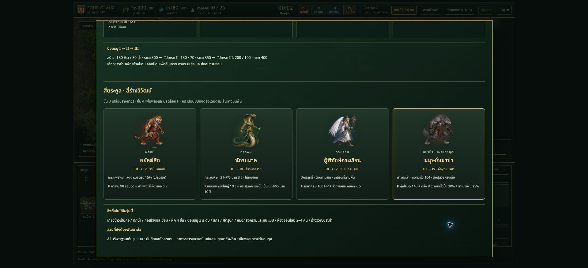

# Four Clans

เกม RTS บนเว็บด้วย JavaScript และ Canvas: แผนที่ป่า 3,200 × 2,400, สี่เผ่า, เก็บข้าว/น้ำ, สร้างฐาน, ฝึกทหารสี่ขั้น, ป้อมธนู และห้องออนไลน์ 2–4 คนผ่าน Node.js + WebSocket

## เปิดเล่นในเครื่อง

ใช้ Node.js 22 ขึ้นไป

```sh
npm ci
npm run build
npm start
```

เปิด <http://localhost:4179> เลือกเมนูและเผ่า แล้วกด **ทดลองครบระบบ** เพื่อทดลองอาคารและทหารขั้นสูง หรือ **เริ่มหมู่บ้าน** เพื่อเริ่มเก็บเสบียงเอง ปุ่ม **สายพัฒนา** แสดงเงื่อนไขการฝึกและร่างวิวัฒน์ทั้งสี่เผ่า

ออนไลน์: กด **ออนไลน์ 4 คน** → สร้างห้อง → ส่งรหัสให้เพื่อน → ทุกคนเลือกเผ่าและกดพร้อม → เจ้าของห้องเริ่มรบ การเล่นข้ามอินเทอร์เน็ตต้อง deploy ตามคู่มือด้านล่าง

อู่ข้าวกระจาย 12 จุดทั่วแผนที่: ใกล้ฐาน 4 จุด (480 ต่อแปลง), พื้นที่ขยายฐาน 4 จุด (720) และพื้นที่กลาง 4 จุด (960) แปลงส่วนกลางใช้ร่วมกันทุกเผ่า สำรวจแล้วเลือกชาวบ้านคลิกขวาที่นาเพื่อเกี่ยว สร้างยุ้งฉางในพื้นที่ที่มองเห็นได้เพื่อรับเสบียงใกล้แปลง ปุ่มสถานะนาวนดูแปลงที่พบได้ ข้าวลดเป็นกอและงอกใหม่ตามรอบเดิม

ระบบกองบุก: **เมนู → ทดลองกองบุก · ม้า/สายลับ** มีคอกพร้อมม้า สายลับ พลหอก เครื่องยิง และค่ายหน้าให้ลองทันที ในเกมปกติให้ชาวบ้านสร้างคอกแล้วคลิกขวาม้าป่าเพื่อจับกลับคอก เลือกทหารมนุษย์คลิกขวาคอกเพื่อขึ้นขี่ กด X เร่งความเร็ว สายลับกด Z ลอบเร้นและถูกตรวจพบเมื่อเข้าใกล้คนหรือป้อม

ชาวบ้านคลิกขวาศัตรูเพื่อโจมตีได้ หรือกด R แล้วคลิกพื้นเพื่อเดินบุก คนเก็บทรัพยากรจะป้องกันตัวเมื่อถูกตีใกล้ ๆ แล้วกลับทำงาน เลือกชาวบ้าน/ทหารขั้น 1–2 แล้วเปิด **ฝึกหน่วยพิเศษ** ในแผงคำสั่ง (เลื่อนลง) เพื่อฝึกสายลับ พลหอก หรือเครื่องยิง

## ทดสอบ

```sh
npm test
```

ครอบคลุมการต่อสู้ เศรษฐกิจ การฝึก ร่างวิวัฒน์ และ WebSocket 4 clients การทดสอบออนไลน์ต้องเปิดพอร์ตในเครื่องได้

## โครงสร้าง

- `src/` — UI, กติกาเศรษฐกิจ, ภาพและการเชื่อมต่อออนไลน์
- `assets/` — ภาพต้นฉบับและ WebP ที่ใช้ในเกม
- `forest-rts-v2-backup.html` — ซอร์ส engine และ renderer ที่ build ยังใช้อยู่ ต้องเก็บใน Git
- `engine-source.cjs`, `multiplayer.cjs`, `server.cjs` — engine ร่วมและเซิร์ฟเวอร์ผู้ตัดสินแมตช์
- `build-village.cjs` — สร้าง `dist/index.html` และหน้า preview; ผลลัพธ์ build ไม่เก็บใน Git
- `.env.example` — ตัวอย่างค่าตั้งค่า ไม่มี secret; เซิร์ฟเวอร์อ่าน environment ของ process ให้ตั้งค่าผ่าน shell หรือโฮสต์

## คู่มือและสถานะ

- [Deploy frontend และ backend](DEPLOY.md)
- [สิ่งที่เล่นได้และข้อจำกัด](GAME-STATUS.md)
- [ที่มาภาพร่างวิวัฒน์และพรอมป์ต์](assets/ASCENSION-ART.md)
- [ที่มาภาพม้า สายลับ เครื่องยิง และพรอมป์ต์](assets/EXPEDITION-ART.md)

ยังเป็นเกมต้นแบบ ตัวเลขสมดุลอยู่ระหว่างทดลอง ห้องอยู่ในหน่วยความจำและหายเมื่อเซิร์ฟเวอร์เริ่มใหม่ ยังไม่มีระบบเซฟหรือ AI บริหารฐานเต็มรูปแบบ


